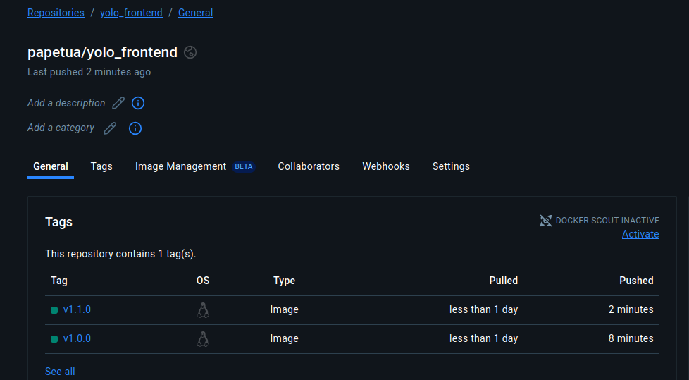
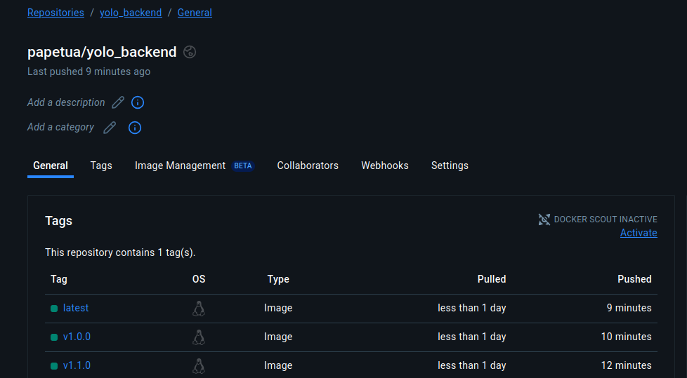

## 1.  Base Image Choice
- **Backend & Frontend**: Used the official `node:18` image for both services to ensure compatibility and stability with Node.js applications.
- **MongoDB**: Used the official `mongo` image for reliable database functionality and ecosystem compatibility.

## 2. ⚙️ Dockerfile Directives

### Backend (`Dockerfile.backend`)
```Dockerfile
WORKDIR /usr/src/app
COPY package*.json ./
RUN npm install
COPY . .
EXPOSE 5000
CMD ["npm", "start"]
```

### Frontend (`Dockerfile.frontend`)
```Dockerfile
WORKDIR /usr/src/app
COPY package*.json ./
RUN npm install
COPY . .
EXPOSE 3000
CMD ["npm", "start"]
```

## 3.  Docker Compose Networking
Defined a custom bridge network called `app-net`:

```yaml
networks:
  app-net:
    driver: bridge
    ipam:
      config:
        - subnet: 172.30.0.0/16
```

Containers communicate internally using service names, such as:

- Mongo URI: `mongodb://mongo-app:27017/yolomy`

##  Container Naming Convention

| Service   | Image Name             | Container Name       |
|-----------|------------------------|----------------------|
| MongoDB   | mongo                  | mongo-app            |
| Backend   | papetua/yolo_backend   | yolo-backend-v1      |
| Frontend  | papetua/yolo_frontend  | yolo-frontend-v1     |

## 4.  Volume Usage
Used a named volume `mongo-data` to persist MongoDB data between restarts:

```yaml
volumes:
  mongo-data:
```

## 5.  Git Workflow
- Forked and cloned the repo.
- Worked in a feature branch for modular development.
- Used descriptive commit messages and regularly pushed to GitHub for version tracking.

## 6.  Debugging Techniques
Used the following to troubleshoot:

```bash
docker logs yolo-backend-v1
docker exec -it yolo-backend-v1 /bin/sh
```

Fixed Axios `Network Error` by adding the following to the `frontend` service in `docker-compose.yml`:
```yaml
stdin_open: true
tty: true
restart: always
```

## 7.  Docker Image Tagging (Versioning)
Used Semantic Versioning (semver) for all images:

Example: `papetua/yolo_backend:v1.1.0`

Tagged and pushed images to DockerHub:

```bash
docker tag yolo_backend papetua/yolo_backend:v1.1.0
docker push papetua/yolo_backend:v1.1.0
```

## 8.  Image Deployment to DockerHub
All versioned images were successfully pushed to DockerHub:

- Backend: `papetua/yolo_backend:v1.1.0`
- Frontend: `papetua/yolo_frontend:v1.1.0`


## 9.  DockerHub Screenshot
All versioned images were successfully pushed to DockerHub:

- 
- 


```

```
