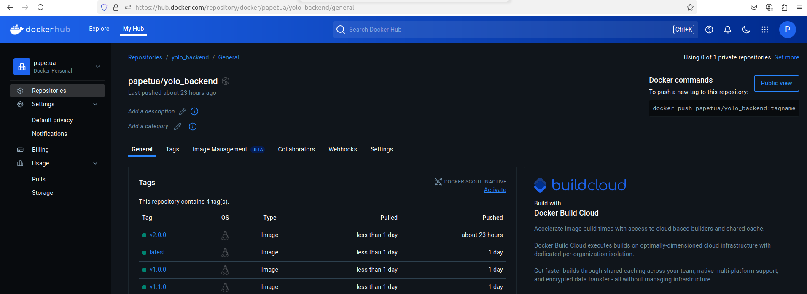
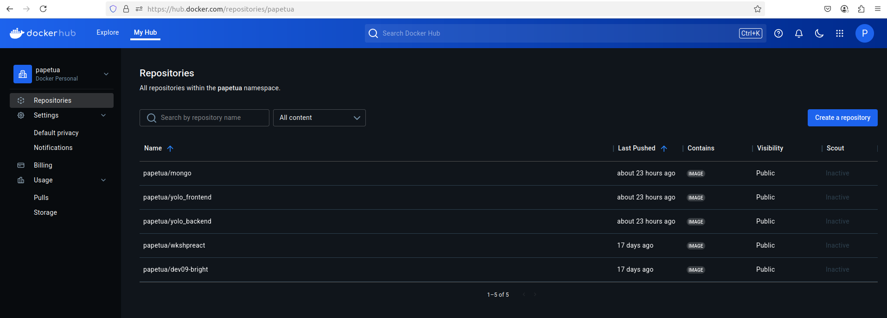

# Explanation: Containerized E-commerce Platform with Product Management

This document explains the design and implementation choices behind the Dockerized e-commerce platform that includes a Node.js backend, a React frontend, and a MongoDB database.

## Prerequisites

Ensure the following tools are installed before running this project:

- **Docker:** [https://www.docker.com/get-started](https://www.docker.com/get-started)
- **Docker Compose:** [https://docs.docker.com/compose/install/](https://docs.docker.com/compose/install/)
- **Git:** [https://git-scm.com/downloads](https://git-scm.com/downloads)

## 1. Cloning the Repository

```bash
git clone https://github.com/Papsy-ops/yolo
cd yolo
```

## 2. Starting the Application

Start the containers using Docker Compose:

```bash
docker-compose up -d
```

This command will:
- Pull three pre-built Docker images from Docker Hub:
  - `papetua/yolo_frontend:v2.0.0`
  - `papetua/yolo_backend:v2.0.0`
  - `papetua/mongo:v2.0.0`
- Create containers for frontend (`yolo-frontend`), backend (`yolo-backend`), and MongoDB (`mongo`)
- Establish a custom Docker network (`app-net`)
- Persist MongoDB data using a named volume (`mongo_data`)

## 3. Accessing the App

After deployment, visit `http://localhost:3000` in your browser to use the application.

---

## Technical Breakdown

### Base Image Choice

- **Backend:** `papetua/yolo_backend:v2.0.0` – Based on a Node.js image, this serves the Express-based backend API.
- **Frontend:** `papetua/yolo_frontend:v2.0.0` – Also based on Node.js, this serves the production React app.
- **MongoDB:** `papetua/mongo:v2.0.0` – Based on `karimtemple/mongo`, optimized for size. Due to directory permission issues, it runs with `--noauth`.

### Dockerfile Directives

All services use pre-built images hosted on Docker Hub. Their internal Dockerfile configurations are assumed to use best practices for minimal, production-grade builds.

### Networking Setup

Defined in `docker-compose.yml`:

```yaml
networks:
  app-net:
    driver: bridge
    ipam:
      config:
        - subnet: 172.30.0.0/16
```

This allows:
- Internal communication between containers (e.g., backend → MongoDB via `mongodb://mongo:27017/yolomy`)
- External access via port mappings:
  - Frontend: `3000:80`
  - Backend: `5000:5000`
  - MongoDB: `27017:27017`

### Volume Persistence

Defined as:

```yaml
volumes:
  mongo_data:
```

And mounted in the MongoDB container:

```yaml
services:
  mongo:
    volumes:
      - mongo_data:/data/db
```

This ensures MongoDB data is persistent across container restarts.

---

## Git Workflow Summary

1. Forked the original repo: `https://github.com/Vinge1718/yolo`
2. Cloned to local environment: `https://github.com/Papsy-ops/yolo`
3. Modified `docker-compose.yml` to use `papetua`-tagged images
4. Committed descriptive changes and pushed to `master` branch

---

## Debugging and Troubleshooting

- Used `docker logs` and `docker exec` to debug issues
- Solved container errors related to MongoDB by disabling authentication (`--noauth`) due to volume permission issues
- Ensured all containers were running and communicating correctly on `app-net`

---

## Docker Image Versioning

All core images follow a consistent tagging convention: `v2.0.0`

- `papetua/yolo_backend:v2.0.0`
- `papetua/yolo_frontend:v2.0.0`
- `papetua/mongo:v2.0.0`

This uniform versioning simplifies updates and dependency management.




---

## MongoDB Authentication

Due to persistent "read-only directory" errors, MongoDB runs with:

```yaml
command: mongod --noauth --bind_ip_all
```

While this works in development, **authentication should always be enabled in production environments**. Previous attempts to set up a user failed due to volume write issues inside the container.

---

## Verification and Image Deployment

All images were tested locally and then pushed to Docker Hub:

- Hosted under the `Papsy-ops` Docker Hub account
- Referenced in `docker-compose.yml` to ensure consistent builds and deployment

---

